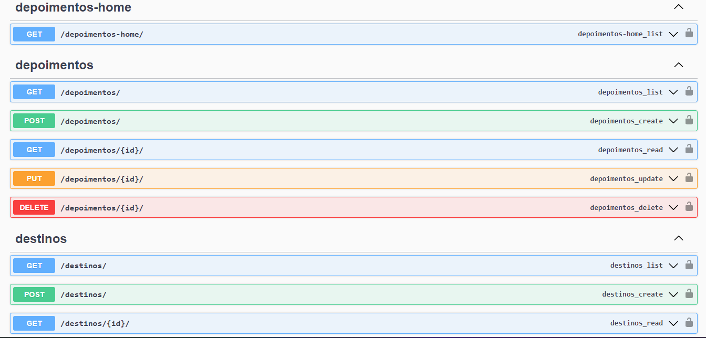

# Jornada Milhas API




## Sobre

> A Jornada Milhas API é uma API REST desenvolvida para uma plataforma que disponibiliza destinos de viagem para seus clientes. <br>
> A aplicação possui endpoints para acessar informações sobre os destinos e depoimentos de outros viajantes, com integração ao chat GPT para gerar automaticamente textos descritivos para os destinos, além de métodos de login para autenticação nos endpoints relacionados aos destinos.


##  Tecnologias Utilizadas

* [Python](https://www.python.org/)
* [Django](https://www.djangoproject.com/)
* [Django-rest-framework](https://www.django-rest-framework.org/)
* [Chat-gpt](https://platform.openai.com/docs/api-reference/chat)
* [SQLite](https://www.sqlite.org/index.html)

## 💻 Pré-requisitos

Antes de começar, verifique se você atendeu aos seguintes requisitos:

* [Git](https://git-scm.com/)
* [Python](https://www.python.org/)

## 🚀 Instalando jornada-milhas-api

Para instalar o jornada-milhas-api, siga estas etapas:

Clone o repositório no diretório desejado:
```
git clone https://github.com/LuanCarvalho0/jornada-milhas-api.git
```

Para acessar o diretório do projeto, use o comando:
```
cd jornada-milhas-api
```

Linux e macOS:
```
python3 -m venv nome_do_ambiente
```

```
source nome_do_ambiente/bin/activate
```

Windows:
```
python -m venv nome_do_ambiente
```

```
nome_do_ambiente\Scripts\activate
```

Instale as Dependências:
```
pip install -r requirements.txt
```

## 🐞 Como rodar os testes
Para executar os testes, utilize este comando:

```
python manage.py test
```

## ☕ Como rodar o projeto

Para rodar o projeto jornada-milhas-api, siga esta etapa:

```
python manage.py runserver
```

> OBS: O comando ira executar a API, lembrando de adicionar suas secrets_key pessoais do django no setup/settings.py, e a secrets_key da OpenAI no openai_api/chat_gpt.py.

## 📃 Documentação

Disponível no endpoint:

```
http://127.0.0.1:8000/docs/
```

## 📝 Licença

Esse projeto está sob licença. Veja o arquivo [LICENÇA](LICENSE) para mais detalhes.
